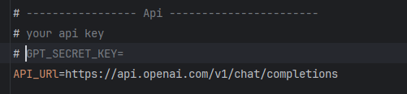

# Checkers bot
This project is a little UI application for jetbrains internship, <br>
Which contains UI for checkers and a small Checkers engine to calculate best moves in parallel
##### P.S
Engine wasn't designed for performance, though it can be improved by adding new module <br>
with board as bitmasks, which will increased engine performance.
## Hot to run the project
To run a project simply clone it:
````bash
git clone https://github.com/kornilov-mr/CheckersBot.git
````
And add your gpt api key in *.env* file in the root:<br>
 <br>
For testing:
````bash
dotnet test
````
## Features:
* All Checkers logic
* Simple Parallel checker Engine
* Basic UI
* Ability to call API for help
* Logging and Environment

